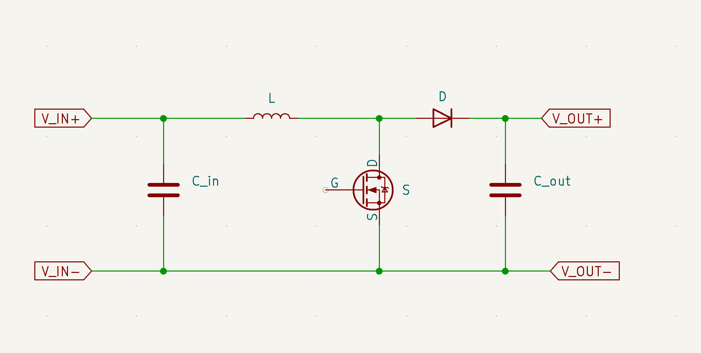
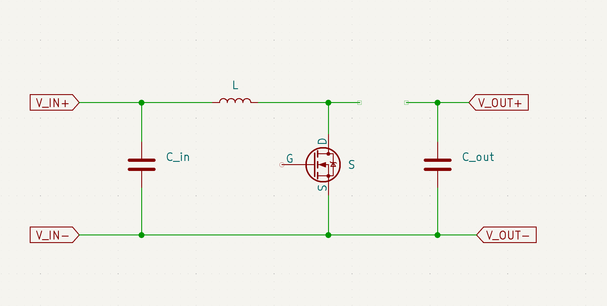
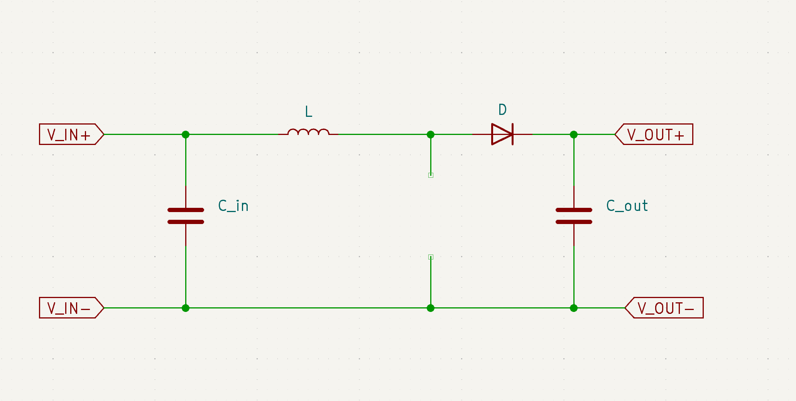
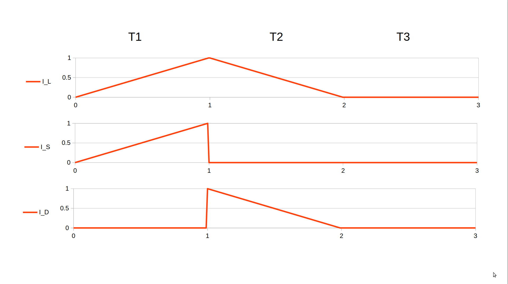

# Boost Converter

This page takes you through the basic design of a boost converter using NES.

## Circuit



First, let’s look at the circuit. The primary objective
here is to convert the lower voltage Vin on the left
side to a higher voltage Vout on the right side.
The diode D prevents any current from flowing back
from the output to the input.



When the switch ( S ) is turned on, the current flows
When the switch ( S ) is turned on, the current flowing
through the inductor ( L ) increases linearly until the
switch is turned off again. During this time energy is
stored in the inductor.



When the switch ( S ) is turned off, the current
doesn’t stop; instead, it continues to flow through
the inductor ( L ) and passes through the diode
( D ) to the output. The current decreases linearly
until it reaches zero. After a brief pause, the switch
( S ) is activated again, and the cycle starts anew.
This operational mode is known as Discontinuous
Conduction Mode (DCM), as the current through
the inductor reaches zero during each cycle.

Alternatively, the circuit can also function in
Continuous Conduction Mode (CCM), where the
switch ( S ) is turned on before the current drops to
zero.

However, for this discussion, we’ll focus
exclusively on DCM.



This graph shows currents through the inductor, the
switch and the diode. During T1, the switch is on.
During T2 the switch is off. During T3 the switch
remains off, but there is no current flowing through
L.

## Small Ripple Approximation

To analyze the circuit, we’ll use the small ripple
approximation. It simplifies things by neglecting the
small voltage changes of the input and output
capacitors during a switching cycle. This greatly
simplifies the model.

## Equations for Elements

### Capacitor

$$ \frac {I \cdot T} {C} = dU $$
The formula states, that a current of I applied to a capacitor of capacitance C for time T results in a voltage
change of dU.

### Inductor

$$ \frac {U \cdot T} {L} = dI $$
Similarly, if a voltage U is applied to an inductor of inductance L for time T,
the current changes by dI.

## Modelling in NES

The following code models the boost converter in NES:

```javascript
lvar f=10 k[Hz]; // switching frequency
var T= 1 u[s]; // period of one switching cycle
f*T=1;

var T1=1 u[s]; // time the switch is on
var T2=1 u[s]; // time the switch is off and current still flows through the inductor and diode
var T3=1 m[s]; // time no current is flowing
T=T1+T2+T3;

var duty=1 %; // fraction of the time the switch is on (duty)
T1 = duty* T;

lvar idle=10 %; // fraction of the time no current is flowing (idle fraction)
T3 = idle * T;

lvar Vin=5[V]; // input voltage and current
var Iin=240 m[A];

lvar Vout=12[V]; // output voltage and current
lvar Iout=100 m[A];

var L = 0.5 m[H]; // inductance

var Ipeak = 529.15026 m[A]; // peak current through the inductor

ind(Vin,T1,Ipeak,L); // inductor equation for the time the switch is on
ind(Vout-Vin,T2,Ipeak,L); // inductor equation for the time the switch is off

Iin=0.5*Ipeak*(T1+T2)/T; // average input current, flowing during T1 and T2
Iout=0.5*Ipeak*T2/T; // average output current, flowing only during T2

// inductor anc capacitor equations from above
eq ind(U,T,dI,L){U*T=dI*L;}
eq cap(I,T,dU,C){I*T=dU*C;}
```
